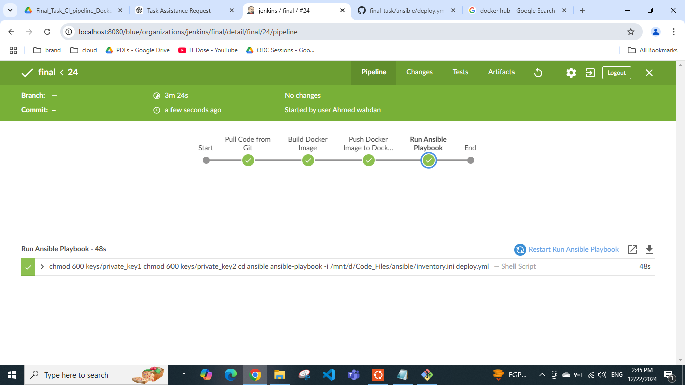
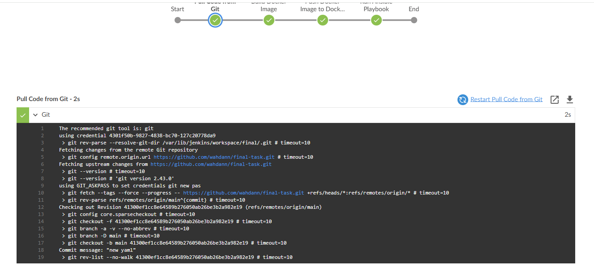
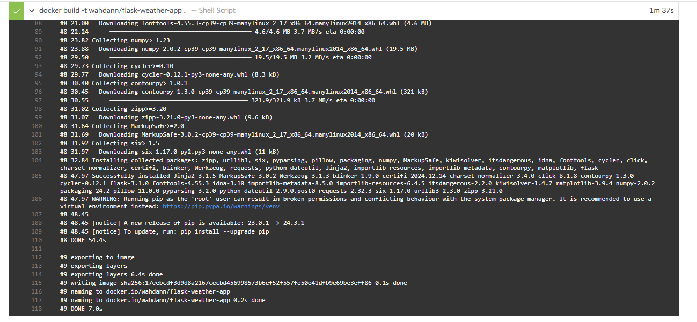
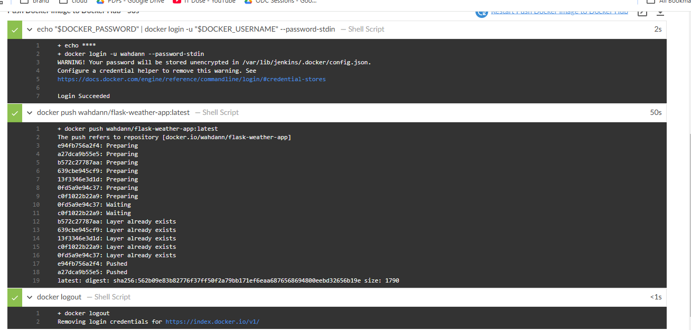
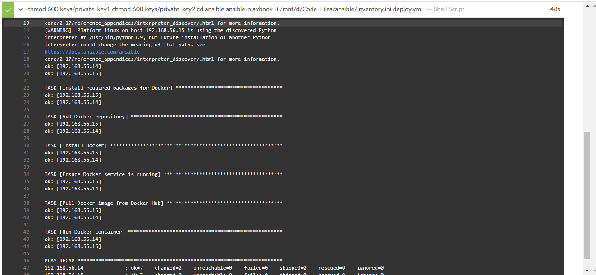
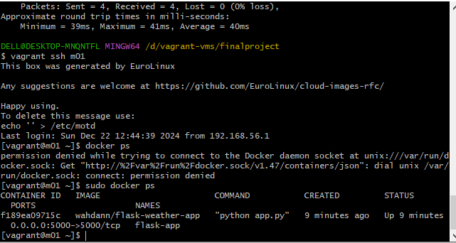
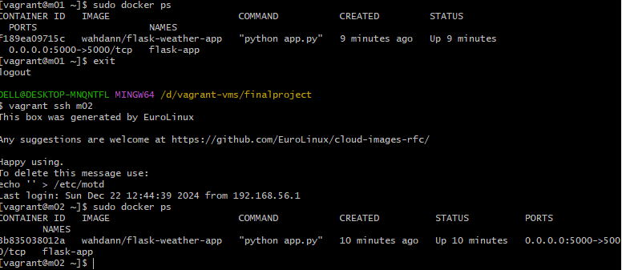
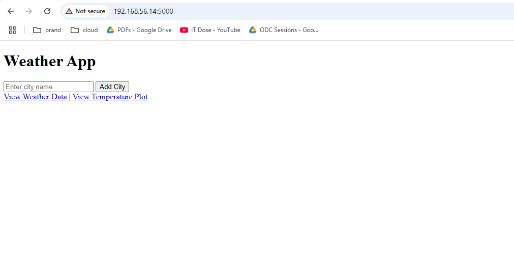
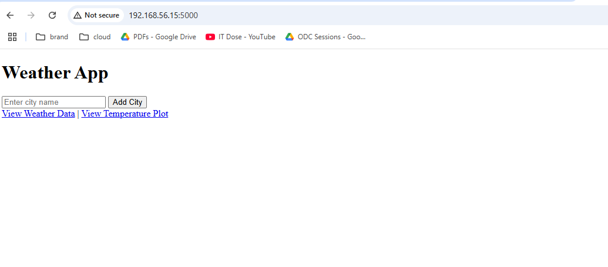
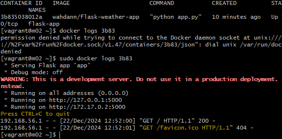

# Build and Deploy a Simple Web Application on Target Machines Using a CI Pipeline

This project demonstrates a full CI/CD pipeline for deploying a containerized Flask weather application to two CentOS Vagrant machines using Jenkins, Docker, and Ansible.

## Table of Contents
- [Overview](#overview)
- [Technologies Used](#technologies-used)
- [Pipeline Stages](#pipeline-stages)
- [Deployment](#deployment)
- [Testing](#testing)
- [Screenshots](#screenshots)
- [How to Run Locally](#how-to-run-locally)

---

## Overview
The Flask Weather App fetches weather data from an external API, stores it in a database, and displays it on a web interface. This project automates the deployment of the app using Jenkins, Docker, and Ansible.

---

## Technologies Used
- *Flask*: For building the web application.
- *Docker*: To containerize the application.
- *Jenkins*: To automate the CI/CD pipeline.
- *Ansible*: For configuration management and deployment on target machines.
- *Vagrant*: For setting up the CentOS development environment.

---

## Pipeline Stages
The Jenkins pipeline includes the following stages:
1. *Pull Code from GitHub*:
   - Fetch the application code from a private GitHub repository.
2. *Build Docker Image*:
   - Create a Docker image for the Flask app.
3. *Push Image to Docker Hub*:
   - Push the Docker image to a public/private Docker Hub repository.
4. *Run Ansible Playbook*:
   - Deploy the application on two CentOS Vagrant machines:
     - Install Docker on target machines.
     - Pull the Docker image.
     - Run the containerized application.

---

## Deployment
1. *Clone the Repository*:
   
   git clone https://github.com/wahdann/final-task.git

2. Set Up Jenkins Pipeline:

Use the provided Jenkinsfile to create a pipeline.


3. Run the Pipeline:

Ensure the pipeline successfully deploys the application to the target machines.


---

## Testing

1. Verify the application is running:

Access the app on each machine:

http://192.168.56.14:5000

http://192.168.56.15:5000


2. Confirm the application responds with the expected output.


---

## Screenshots

- Jenkins Pipeline Stages :







- Running Containers :








---

## How to Run Locally

1. Set Up Python Environment:

Install dependencies:

pip install -r requirements.txt

Run the application:

python app.py


2. Run with Docker:

Build and run the container:
```
docker build -t flask-weather-app .
docker run -p 5000:5000 flask-weather-app
```
